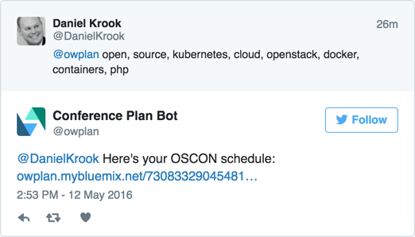

## Conference Plan Bot

The *Conference Plan Bot* is a serverless, event-driven, bot built on the [OpenWhisk open source project](http://openwhisk.org/).

An instance is running on the hosted OpenWhisk environment provided by IBM Bluemix. It has an associated Cloud Foundry app at http://owplan.mybluemix.net/ which provides the schedule UI, and two proxy services for handling Twitter integration and IoT device reading API calls.

The bot is designed to reply to user tweets that request conference schedule information with real time data on sessions and room conditions. It's currently configured for the [O'Reilly Open Source Convention (OSCON)](http://conferences.oreilly.com/oscon/open-source-us) which runs from May 16th to May 20th.

For example, if you tweeted [@owplan](https://twitter.com/owplan) with the keywords "serverless, bot, Docker, containers" you'd get back a list of sessions at OSCON conference matching those terms for each day.

You can read more about bots, serverless programming, and the motivation for the Conference Plan Bot on the blog post at [developerWorks Open](https://developer.ibm.com/open/2016/05/13/openwhisk-planner-bot/).

## Installation

Detailed instructions are pending. This repository is meant to provide examples of reusable code and approaches to building OpenWhisk based bots, rather than completely working code with all dependencies.

For now, explore `devops/create-update-actions.sh` and the individual action code in the `openwhisk/actions/js` folder. These describe the microservices built for the demo, and represent actions of moderate complexity that are broken into several files and use promises to handle asynchronous processing.

Your primary workflow after setup will be editing actions in JavaScript, compiling them if they consist of more than one file (or have third party NPMs not provided by your OpenWhisk environment), and uploading them.

To get started with an OpenWhisk bot running on Bluemix, you will need to do the following:

- Provision prerequisite services
  - Log into Bluemix, request access to OpenWhisk (if still in a closed beta)
  - Create two services. Free tiers are sufficient for both. You can create them directly in Bluemix or via the service provider directly.
    - Cloudant - Provides a NoSQL database for the three Cloudant databases: `room`, `schedule`, and `tweet`.
    - SendGrid - Provides an email interface for Twitter which can then invoke the `tweet-fetch` action.
  - Create a Twitter account for your bot and an associated application in order to use the API.
- Work with the OpenWhisk code
  - `git clone` this repository.
  - Option 1: Set up a development environment with Vagrant
    - `cd` to the `owplan/devops` folder
    - Run `vagrant up`
    - `vagrant ssh` to the node
    - Install the OpenWhisk CLI
    - Review the NPM packages that you might have to install in `devops/setup-workstation.sh`
  - Option 2: Set up a development on your Mac/Windows/Linux workstation
    - Install the OpenWhisk CLI
    - Review the NPM packages that you might have to install in `devops/setup-workstation.sh`
  - Modify the configuration files and settings for each action.
    - Cloudant - The `cloudant-config.json` file within each relevant action folder.
    - Twitter - The `twitter-config.json` file within each relevant action folder.
    - Replace each instance of `user@example.org_space` for your Bluemix account.
  - Run the builds and install the OpenWhisk actions with `devops/create-update-actions.sh`
  - Verify actions, triggers, rules with
    - `wsk action list`
    - `wsk trigger list`
    - `wsk rule list`
- Work with the associated Cloud Foundry application
  - Create the Cloud Foundry app on Bluemix, which provide the schedule UI for the bot to link to.
    - Install the Cloud Foundry CLI
    - Go to the `web` directory, modify `web/manifest.yml` as needed
    - Run `cf push` to upload the PHP application to Bluemix.
- Set up the Arduino device
  - Procure an Arduino UNO R3, WiFi shield, and Digital Hygrometer/Thermometer.
  - Assemble the hardware.
  - Install the Arduino IDE for your workstation or VM
  - Load the `iot/room/room.ino` file, edit the WiFi settings and your Bluemix app endpoint, then verify and upload it to the Arduino via USB.
  - Make sure it's emitting data and your proxy app is collecting data.

## Architectural decisions
- The actions in a sequence are currently invoked manually from within each microservice. This could be done as a sequence to decouple the linkage of actions, but we'd have less control over error handling. Cloudant could also be used more completely as a state machine to trigger actions, but we moved away from that approach to improve performance.
- Twitter does not integrate well with Twilio for sending text messages for incoming mentions. Therefore we use a SendGrid managed email address to achieve a similar goal of notification when a tweet is received.
- There is still a need for a Bluemix Cloud Foundry app to provide the complex schedule UI and proxy requests to the Cloudant database from the Arduino sensors and from SendGrid. The proxies could be replaced by API Connect, API Registration, or Watson IoT services from the Bluemix catalog. The big challenge is handling SSL and mapping API requests directly to the OpenWhisk API.

## TODO
- [ ] Complete the installation instructions, including how to download dependencies not included in this repository.
- [ ] Move strings and other OSCON specifics to properties files to enable reusability for other events.
- [ ] Add sparklines to show room temperature trends over time, as a way to predict some room conditions in the future, such as baseline temperature at a certain hour.

## Contributors

See [CONTRIBUTING.md](CONTRIBUTING.md) for details.

## License

See [LICENSE](LICENSE) for details. This demo is built with dependencies on several NPM packages, Bootstrap, and Arduino hardware libraries. You'll need to include those separately to build a working instance of this bot.
